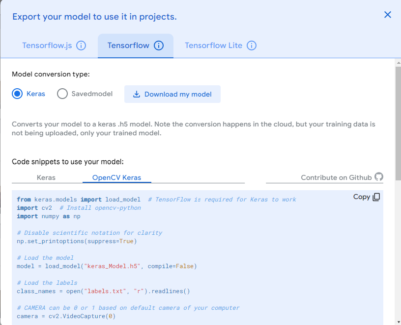

# Welcome to Item Recognition 
This repo is just demonstrating the use of https://teachablemachine.withgoogle.com/, as I just wanted to mess around with it :)

# How to run the code:

- Before trying the code, you must first go to the link above and create a keras model and use the image model. Please make sure to flip the camera when training the model, as streamlit is set that way.
- Train a model to pick up which way you are looking and make sure the labels for each motion is sensible. 
- Once that is done, download the kersa model  ,and put the compressed file into the repo.
- Decompress the file, which should leave with you two new files, a keras_model file and labels.txt.
- now, run ' pip install -r requirement.txt ', this will download all required libaries you need.
- once everything runs smoothly, run this command ' streamlit run app.py' 

# Demo of the code running

item_detection.mp4

